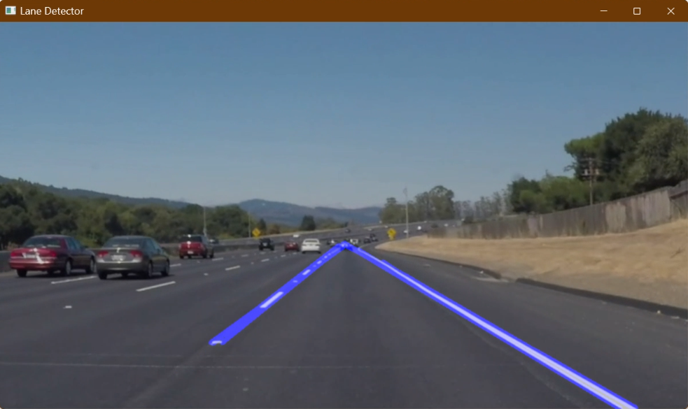
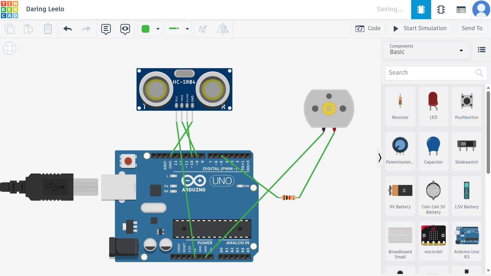
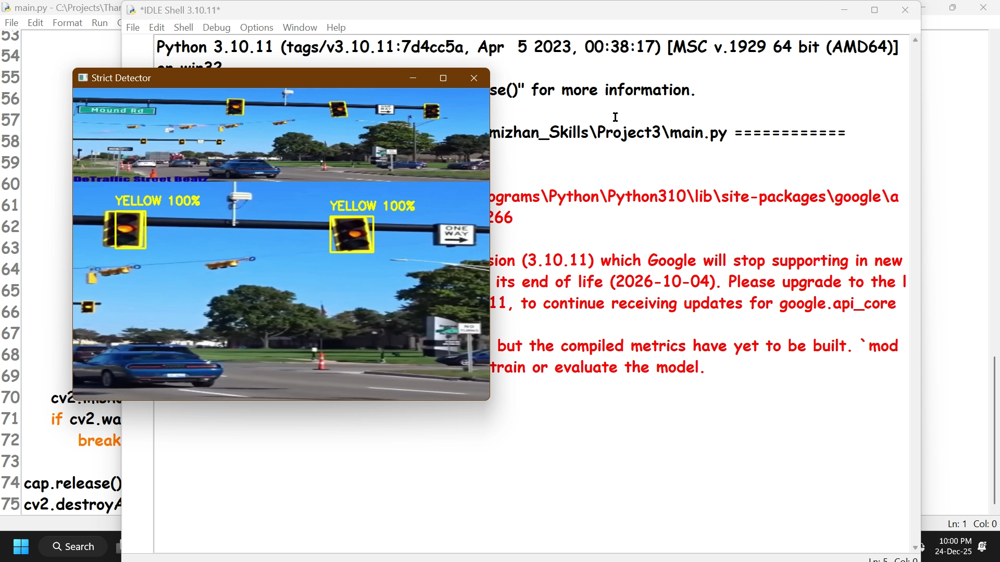
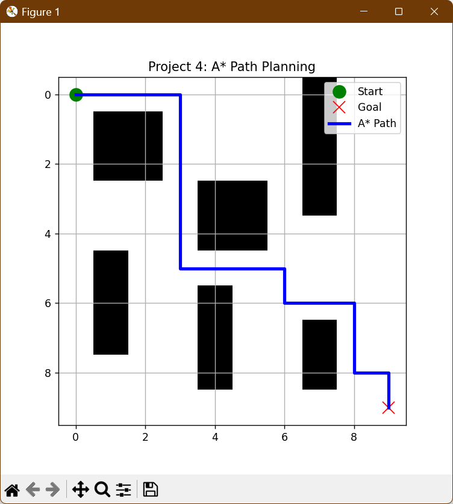
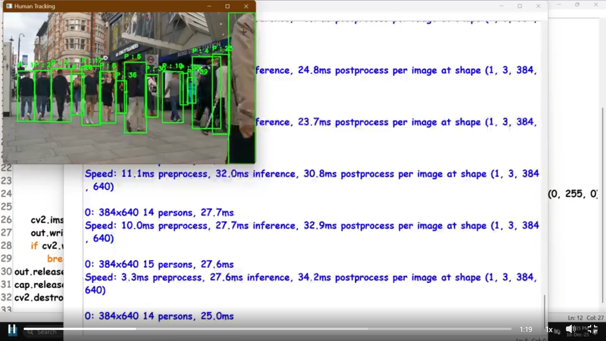
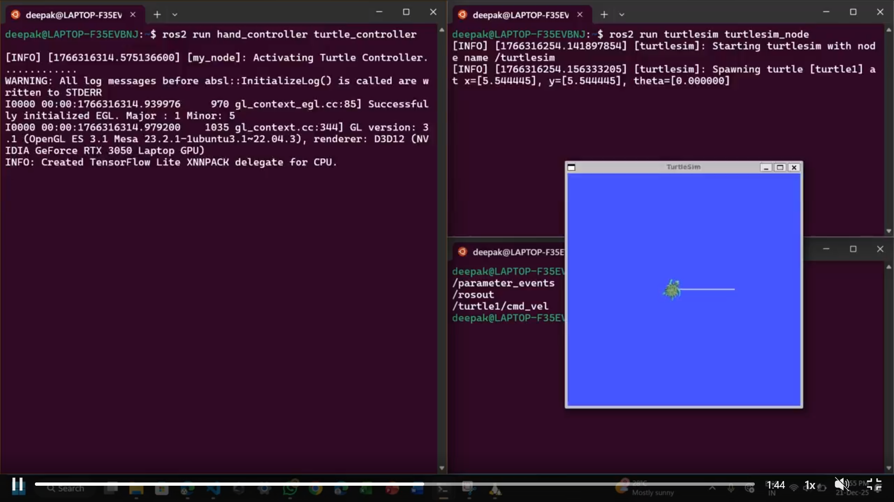
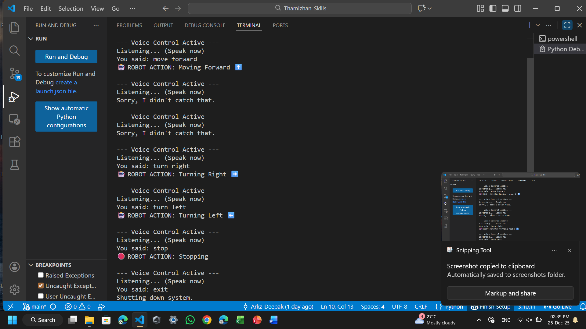

# 🚗 AI for Autonomous Systems | RISE Internship Portfolio

**Internship Period:** [Insert Date]  
**Domain:** Computer Vision, Robotics, Deep Learning, Path Planning  
**Status:** ✅ Complete (8/8 Projects)

---

## 📖 Overview
This repository contains the complete software stack developed during the **RISE Internship for AI in Autonomous Systems**. The goal was to build the core modules required for a Level 3 Autonomous Vehicle, ranging from **Perception** (detecting lanes and humans) to **Planning** (A* pathfinding) and **Control** (PID Drone flight).

## 🛠️ Tech Stack
* **Languages:** Python 3.10, C++ (Arduino)
* **Computer Vision:** OpenCV, YOLOv8, MediaPipe
* **Deep Learning:** TensorFlow/Keras, Scikit-Learn
* **Simulation:** Matplotlib, Tinkercad, Turtle Graphics
* **Hardware Logic:** PID Control, Ultrasonic Sensors, Voice API

---

## 📂 Project Modules

### 👁️ Module 1: Perception (Vision & Detection)

#### 1. Real-Time Lane Detection
* **Goal:** Identify road boundaries in video feeds for self-driving cars.
* **Tech:** OpenCV, Canny Edge Detection, Hough Transform, Region of Interest (ROI) Masking.
* **Result:** Accurately plots lane lines on curved and straight roads.


#### 2. Traffic Light Classification (CNN)
* **Goal:** Detect and classify traffic signals (Red/Green/Yellow).
* **Tech:** Custom CNN (Convolutional Neural Network) trained on GTSRB data, HSV Color Filtering for noise removal.
* **Result:** 99% Validation Accuracy with real-time strict filtering for false positives.


#### 3. Human Detection & Tracking (YOLO)
* **Goal:** Detect pedestrians and track them to prevent collisions.
* **Tech:** YOLOv8 (Ultralytics), Object Tracking (ID assignment).
* **Result:** Real-time bounding boxes with unique IDs at 30+ FPS.


---

### 🧠 Module 2: Planning & Logic

#### 4. A* Path Planning
* **Goal:** Compute the optimal shortest path in a grid map with obstacles.
* **Tech:** A* Algorithm (Heuristic Search), Matplotlib Visualization.
* **Result:** Visualized optimal route finding in complex grid environments.


#### 5. Obstacle Avoidance System (Simulated)
* **Goal:** Autonomous braking and decision-making based on sensor data.
* **Tech:** Random Forest Classifier (AI), Python Turtle Simulation, Tinkercad (C++).
* **Result:** Robot automatically slows down or triggers emergency braking when obstacles are <30cm.


---

### 🎮 Module 3: Control & Interaction

#### 6. Gesture-Controlled Robot
* **Goal:** Teleoperate a robot using hand signs.
* **Tech:** MediaPipe Hands, Geometry Logic.
* **Result:** Mapped hand positions to 'Stop', 'Forward', 'Left', and 'Right' commands.


#### 7. Autonomous Drone Flight (PID)
* **Goal:** Simulate stable flight dynamics for a quadcopter.
* **Tech:** PID Controller (Proportional-Integral-Derivative), 3D Physics Simulation.
* **Result:** Smooth 3D flight path through 4 waypoints including takeoff and landing.

#### 8. Voice-Activated Navigation
* **Goal:** Natural Language Interface for robotic control.
* **Tech:** SpeechRecognition Library, Google Speech API.
* **Result:** Converts spoken commands ("Go Forward") into executable robot actions.


---

## 🚀 How to Run
1.  **Clone the repository:**
    ```bash
    git clone [https://github.com/Arkz-Deepak/Thamizhan_Skills](https://github.com/Arkz-Deepak/Thamizhan_Skills)
    cd Thamizhan_Skills
    ```

2.  **Install Dependencies:**
    ```bash
    pip install opencv-python tensorflow ultralytics mediapipe matplotlib SpeechRecognition
    ```

3.  **Run a Module (Example: Human Detection):**
    ```bash
    python human_tracker.py
    ```

---

## 📜 Conclusion
This internship provided hands-on experience in the full robotics pipeline. By integrating **Classic Computer Vision** (Lanes) with **Modern Deep Learning** (YOLO/CNN) and **Control Theory** (PID), I successfully built a modular foundation for autonomous systems.

---
*Created by Deepak R*
